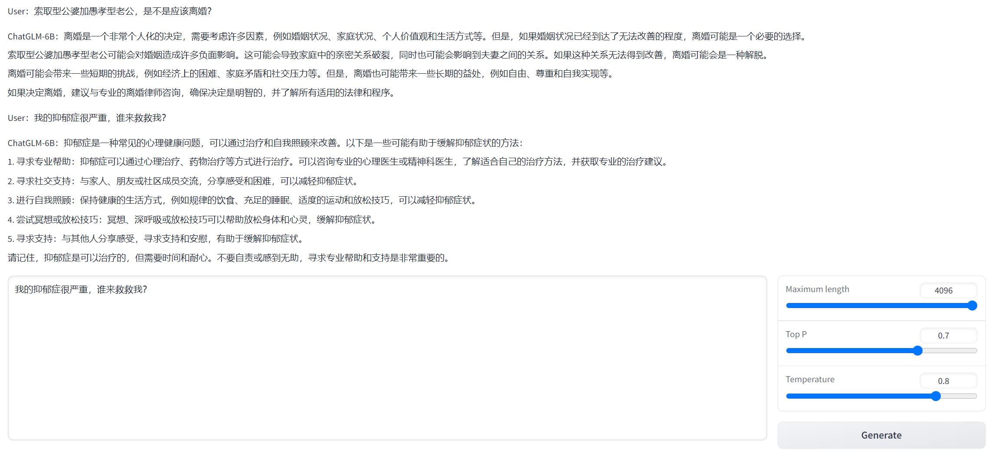

# chatglm6b_ft

chatglm6b local build and fine tuning||chatglm6b本地化部署与微调

## 1.Deployment

### 1.本地部署

GPU:FP16（无量化）13 GB显存显卡

首先拷贝仓库，之后安装requirements.txt指示的package，运行[chatglm6b.py](code/chatglm6b.py)修改prompt部分获得response。

```
# git clone https://huggingface.co/THUDM/chatglm-6b
# pip install -qr requirements.txt

from transformers import AutoTokenizer, AutoModel
tokenizer = AutoTokenizer.from_pretrained("THUDM/chatglm-6b", trust_remote_code=True)
model = AutoModel.from_pretrained("THUDM/chatglm-6b", trust_remote_code=True).half().cuda()
model = model.eval()
response, history = model.chat(tokenizer, "谈7年的男友，分开两年又和好，嫌我胖是不是不爱我？", history=[])
print(response)
```

### 2. Google Colaboratory部署

GPU: Tesla T4，需选择最少6 GB显存显卡

[](https://colab.research.google.com/drive/1-4UOCQtzX2OsdgbQOiukeX2r-wNCEJDC) 在线部署ChatGLM-6B的量化4等级模型，具体实现见[ChatGLM_6B_int4_Web_Demo.ipynb](code/ChatGLM_6B_int4_Web_Demo.ipynb)

生成的界面示例如下：



## 2.Fine-tuning

一种平价的chatgpt实现方案，基于清华的 ChatGLM-6B + LoRA 进行finetune.
